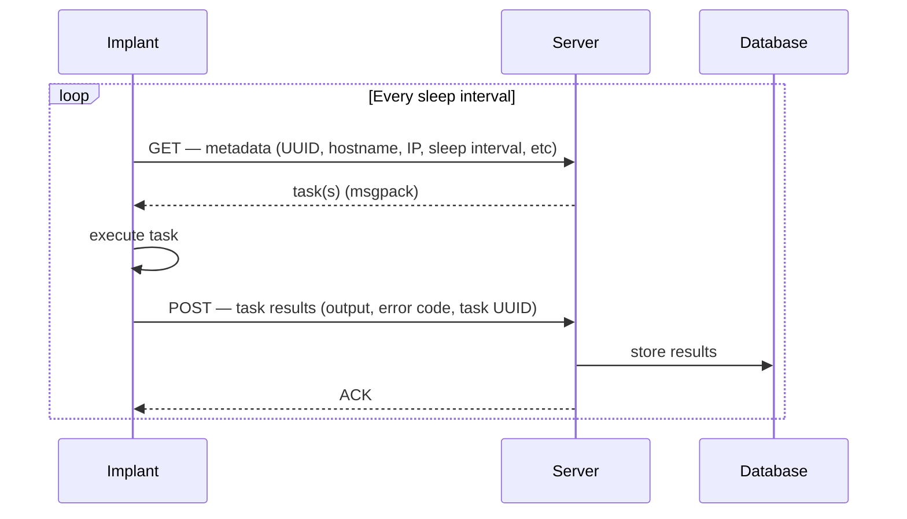

# Beaconing

The implant communicates with the server in a loop. Understanding this loop is prerequisite reading for network profiles, listener configuration, and strategy switching.

---

## The Loop

The implant wakes, sends a GET beacon, receives tasks (or nothing), executes any work, POSTs the results, and goes back to sleep. This is the entire communication model.

---

## Why Two Channels?

GET and POST are kept separate to minimize traffic noise. The GET beacon is intentionally lightweight — just metadata, no task data. Full data transfer only happens on POST, and only when the implant actually has results to return. An implant with no pending work produces only small, regular GET packets.

---

## What Each Stage Carries

| Stage | Direction | Payload | Profile token |
|---|---|---|---|
| GET (beacon) | implant → server | Implant metadata: UUID, hostname, external IP, sleep interval, etc | `<METADATA>` in `[raw.get]` |
| GET (response) | server → implant | Pending tasks (msgpack-encoded), or empty if none | `<OUTPUT>` in `[raw.get.server]` |
| POST (exfil) | implant → server | Task results: output, error code, task UUID | `<OUTPUT>` in `[raw.post]` |
| POST (response) | server → implant | ACK, or empty | `[raw.post.server]` body |

The `<METADATA>` and `<OUTPUT>` tokens in a network profile correspond exactly to these payloads. When you write `body = "<METADATA>"` in `[raw.get]`, you are telling the listener: "the GET beacon body is the encoded implant metadata, nothing else."

See [Mimicry](../06%20Network%20Profiles/Overview.md) for further details on this.

---

## Sleep

The implant sleeps a configurable number of seconds between GET beacons. Update it at runtime with `sleep <seconds>` in the implant terminal. There is no separate sleep for POST — exfil happens immediately after task execution, before the next sleep cycle begins.

---

## Related

- [Raw Profiles](../06%20Network%20Profiles/Raw%20Profiles.md) — how `[raw.get]` / `[raw.post]` map to this loop in the profile TOML
- [Listeners](../01%20Listeners/Overview.md) — the network process that handles inbound GET/POST traffic
- [Commands](../02%20Implants/1.%20Commands.md) — `sleep`, `strat list`, `strat set` for runtime control
